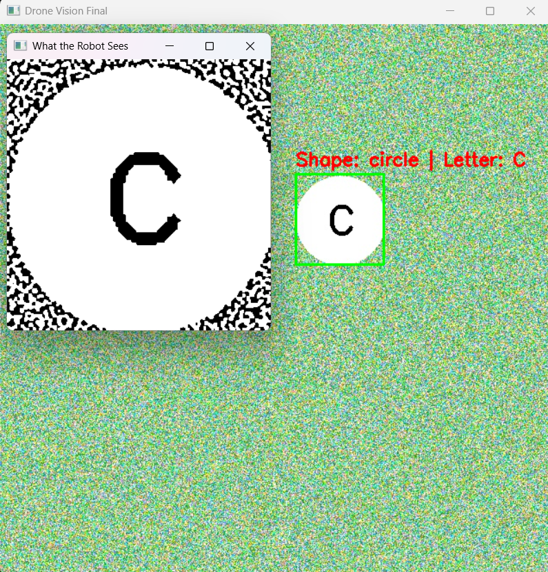

# Object Detection and OCR Pipeline

## Project Overview
This project implements a comprehensive computer vision system designed for autonomous aerial systems to identify and read ground-based targets. The pipeline has evolved from a basic shape detector (V1) to a robust system capable of reading alphanumeric characters in high-noise environments (V2).

The system uses deep learning (YOLOv8) for object detection and optical character recognition (OCR) to interpret targets. It is designed to handle synthetic imagery that mimics real-world conditions, including variable lighting, Gaussian noise, and different geometric shapes.

---

## Version 1: Basic Shape Detection (Proof of Concept)
The initial version of the project focused on the fundamental feasibility of detecting geometric shapes on a noisy terrain background.

### Features
* **Target Classes:** 2 (Circle, Rectangle).
* **Dataset:** Small-scale synthetic dataset (100 images).
* **Technique:** Standard YOLOv8 training.

### Files
* `generate_data.py`: Generates 100 simple images with random circles or rectangles on a green background with light noise.
* `train.py`: Trains a YOLOv8 Nano model for 50 epochs on the V1 dataset.
* `predict.py`: Generates a single random synthetic image and runs inference to verify if the model can distinguish a circle from a rectangle.

### How to Run V1
1. **Generate the data:**
   ```bash
   python generate_data.py

2. **Train the model:**
   ```Bash
   python train.py

3. **Test the result (creates final_proof.jpg):**
   ```Bash
   python predict.py

---

## Version 2: Advanced Detection & OCR (Production Pipeline)
The current version upgrades the system to handle complex competition-level requirements, including character recognition and heavier noise handling.

### Features
* **Target Classes:** 3 (Circle, Triangle, Rectangle).
* **Dataset:** Large-scale synthetic dataset (2,000+ images) with randomized alphanumeric characters and heavy Gaussian noise.
* **OCR Integration:** Implements a multi-stage pipeline to detect, crop, clean, and read text.
* **Noise Resistance:** Uses advanced image processing (adaptive thresholding and morphological opening) to filter out static before reading text.

### Files
* `generate_suas.py`: Generates the enhanced dataset with letters and heavy noise.
* `train_suas.py`: Trains the YOLOv8 model on the V2 dataset.
* `test_model.py`: The main inference script. It performs the full pipeline:
    * **Detection:** YOLOv8 finds the shape.
    * **Preprocessing:** Upscales the crop 3x and applies adaptive thresholding to remove noise.
    * **Recognition:** EasyOCR reads the text using a strict alphanumeric allowlist.

### How to Run V2
1. **Generate the advanced dataset:**
   ```bash
   python generate_suas.py

2. **Train the robust model:**
   ```bash
   python train_suas.py

3. **Run the full pipeline (opens visualization windows):**
   ```bash
   python test_model.py

---

## Technical Approach (V2 Pipeline)
The V2 pipeline solves the problem of low-resolution OCR through specific preprocessing steps:
* **Upscaling:** The target region is resized by a factor of 3 using bicubic interpolation. This provides the OCR engine with more pixels to define character edges.
* **Denoising:** A Gaussian blur is applied to smooth out high-frequency static.
* **Adaptive Thresholding:** The image is converted to binary (black and white) based on local pixel neighborhoods, effectively separating the character from the noisy background.
* **Morphological Operations:** An "opening" operation is applied to remove remaining small noise artifacts (salt-and-pepper noise) that could be mistaken for punctuation.
**Here is an example of the final output:**



---

## Installation

**Prerequisites:** This project is optimized for **Python 3.11**.

### Option 1: Quick Setup (Recommended)
We have provided automated scripts to set up the virtual environment and install dependencies for you.
* **Windows:** Double-click `setup_env.bat`.
* **Linux / Mac:** Run `bash setup_env.sh` in your terminal.

### Option 2: Manual Setup
If you prefer to set it up yourself:

1.  **Clone the repository:**
    ```bash
    git clone https://github.com/whoisadi19/object-detection.git
    cd object-detection
    ```

2.  **Create and activate a virtual environment:**
    * **Windows:**
        ```bash
        python -m venv venv
        venv\Scripts\activate
        ```
    * **Linux / Mac:**
        ```bash
        python3 -m venv venv
        source venv/bin/activate
        ```

3.  **Install dependencies:**
    ```bash
    pip install -r requirements.txt
    ```